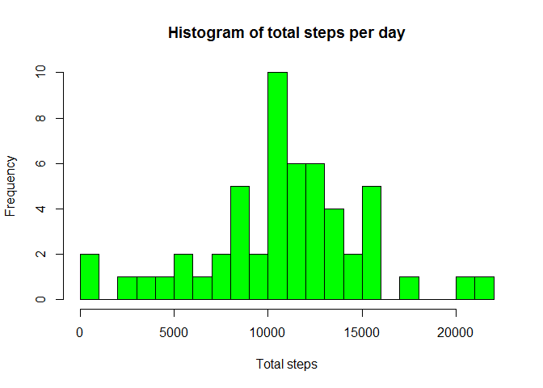
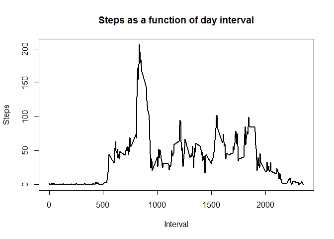
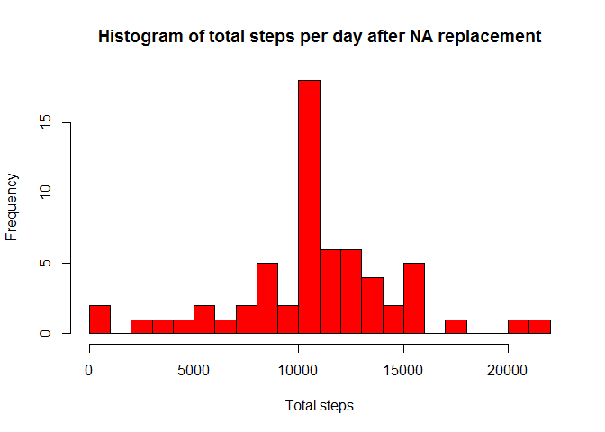
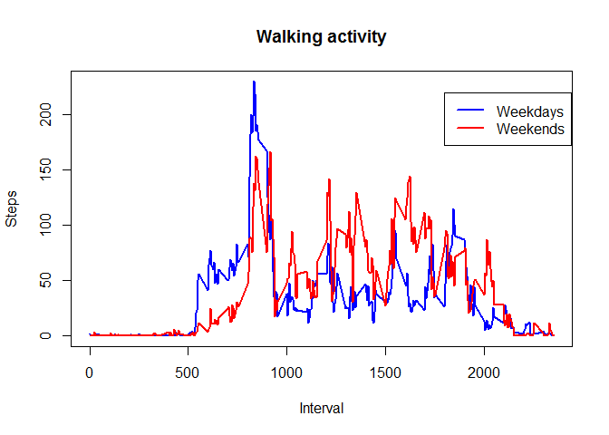

# Reproducible Research: Peer Assessment 1

# --------------------------------------------------------------------------------
# 
##Getting started

```r
library(dplyr)
rm(list=ls()) #Cleans previous variables
knitr::opts_chunk$set(results="hide", warning=FALSE, message=FALSE) #environment variables
```

## Loading and preprocessing the data

```r
#Reads data
data=read.csv("activity.csv", header=TRUE)
data$date=as.Date(data$date) # Formats date
```

## What is mean total number of steps taken per day?

```r
#Creates different dataframe with no NAs
data.na=na.omit(data)

#Creates table with total steps by day
summary_day=data.na %>%
    select(1:2) %>% #drops the interval column
        group_by(date) %>%
            summarise_each(funs(sum))

#Mean and median total number of steps taken per day
mean=mean(summary_day$steps)
median=median(summary_day$steps)

#Plots histogram of steps per day
hist(summary_day$steps, breaks=20, main="Histogram of total steps per day", xlab = "Total steps", col="green")
```

 

###Solution:
####The mean number of steps per day is 10766.2 and the median is 10765.0

------------------------------------------------------
------------------------------------------------------
------------------------------------------------------

## What is the average daily activity pattern?

```r
#Creates table with average steps per interval
summary_interval=data.na %>%
    select(c(1,3)) %>% #drops the dates column
        group_by(interval) %>%
            summarise_each(funs(mean))
#Max number of steps
max=max(summary_interval$steps)
#Interval for where the maximum number of steps occur
inter=summary_interval$interval[which(summary_interval$steps == max(summary_interval$steps))]

plot(summary_interval, main="Steps as a function of day interval", xlab = "Interval", ylab = "Steps", pch=20)
```

 

###Solution:
####The maximum number of steps is 206.2 and occurs during the interval 835

------------------------------------------------------
------------------------------------------------------
------------------------------------------------------

## Imputing missing values

```r
#Number of rows where steps=NA
number.na.steps=sum(is.na(data$steps))

data_NA=subset(data, is.na(data$steps))

#Generate new dataframe where NA values are replaced by average value for the corresponding interval
data_replace=data
for(i in 1:nrow(data)){
    if(is.na(data[i,1])) { # if step value is NA
        interval=data$interval[i] # get what interval corresponds to that NA value
        data_replace[i,1]=summary_interval[which(summary_interval$interval == interval),2]
    }
}

#Creates table with the total steps by day
summary_day_rep=data_replace %>%
    select(1:2) %>%
        group_by(date) %>%
            summarise_each(funs(sum))
#Mean and median total number of steps taken per day
mean2=mean(summary_day_rep$steps)
median2=median(summary_day_rep$steps)

#Plots histogram of steps per day
hist(summary_day_rep$steps, breaks=20, main="Histogram of total steps per day after NA replacement",
     xlab = "Total steps", col="red")
```

 

###Solution:
####There are 2304 rows that have a NA value. After replacing the NA values with the average number of steps for that particular interval, the mean number of steps per day is 10766.2 and the median is 10766.2. Very similar to the values before the replacement.

------------------------------------------------------
------------------------------------------------------
------------------------------------------------------


## Are there differences in activity patterns between weekdays and weekends?

```r
#Formats date as dates and adds column with weekday
data_replace$weekday=weekdays(data_replace$date) # Adds column with day

#Generate separate datasets for weekdays and weeekens only
data_replace.weekend=subset(data_replace, weekday=="Saturday"|weekday=="Sunday")
data_replace.weekday=subset(data_replace, !(weekday=="Saturday"|weekday=="Sunday"))

#Creates table with average steps per interval during weekdays
summary_interval_weekday=data_replace.weekday %>%
    select(c(1,3)) %>% #drops the dates column
        group_by(interval) %>%
            summarise_each(funs(mean))

#Creates table with average steps per interval during weekends
summary_interval_weekend=data_replace.weekend %>%
    select(c(1,3)) %>% #drops the dates column
        group_by(interval) %>%
            summarise_each(funs(mean))

weekday_walk=sum(summary_interval_weekday$steps) # Average total steps per day during weekdays
weekend_walk=sum(summary_interval_weekend$steps) # Average total steps per day during weekends

#plot(summary_interval_weekday, col="blue", main="Walking activity", xlab = "Interval", ylab = "Steps", pch=20)
plot(summary_interval_weekday, col="blue", main="Walking activity", xlab = "Interval", ylab = "Steps", type="l",lwd=2)
points(summary_interval_weekend, col="red", xlab = "Interval", ylab = "Steps", type="l",lwd=2)
legend(1800,220, c("Weekdays", "Weekends"), lty=c(1,1), lwd=c(2,2), col=c("blue","red"))
```

 

###Solution:
####It appears that walking activity begins and ends earlier during the weekdays than in the weekends, it also looks like the subject walks less in the weekdays (an average of 10255.8 steps per day) than in the weekends (with an average of 12201.5 steps per day)
